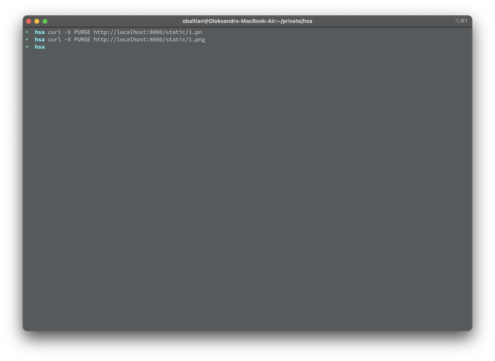
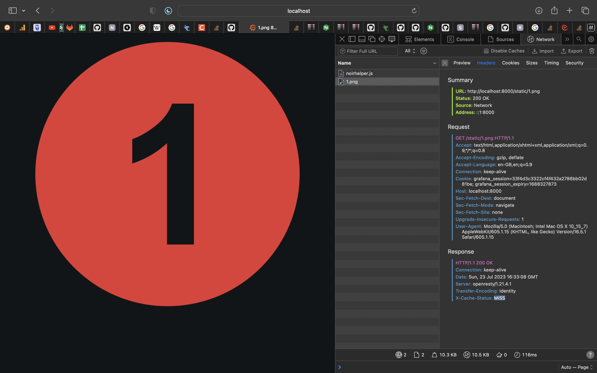
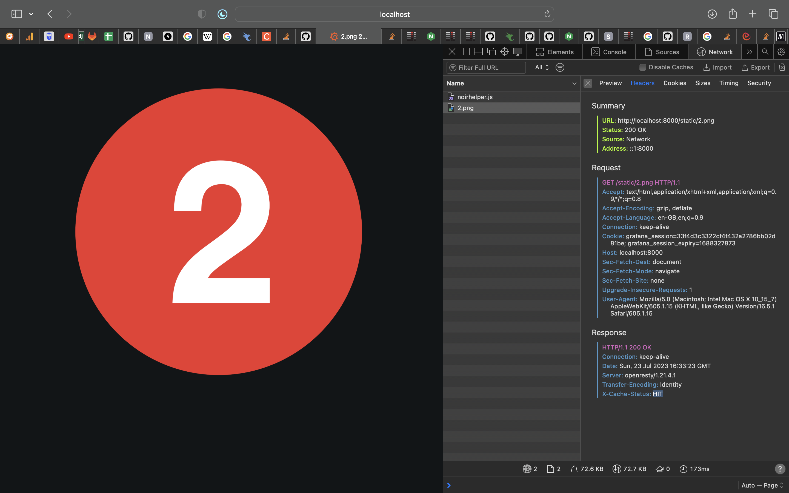

# Nginx per-item-cache sample configuration

## Task

Configure nginx that will cache only static, that were requested at least twice.
Add ability to drop nginx cache by request.
You should drop cache for specific file only ( not all cache ).

## Solution

Openresty and its [lua-resty-lrucache](https://github.com/openresty/lua-resty-lrucache/tree/master) module is used for in-memory cache of 2 static files.
The cache is invalidated by sending a PURGE request to the same URI.

You can see if image was cached by checking `X-Cache-Status` header (`HIT` or `MISS`).

### Showcasing

1. Start server: `docker-compose up`

2. Open http://localhost:8000/static/1.png in browser. You should see `X-Cache-Status: MISS` header. 

3. Open http://localhost:8000/static/1.png again – `X-Cache-Status: MISS`, because item is cached only after second request. 

4. Open http://localhost:8000/static/1.png again – `X-Cache-Status: HIT` 

5. Also open other image 3 times: http://localhost:8000/static/2.png. You should see `X-Cache-Status: HIT` header. 

6. Purge 1st image cache: `curl -X PURGE http://localhost:8000/static/1.png` 

7. Open http://localhost:8000/static/1.png again – `X-Cache-Status: MISS` (purged) 

8. Open http://localhost:8000/static/2.png again – `X-Cache-Status: HIT` (not purged) 
